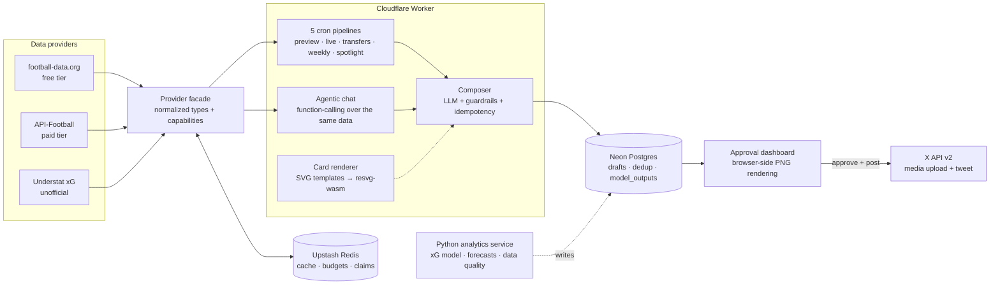

# bluebot — a production football data & publishing system

A one-person, $0/month production system that turns live football data into
data-accurate posts: five cron pipelines, a provider-abstracted data layer,
an LLM composer that is structurally prevented from inventing numbers, an
in-worker SVG→PNG infographic renderer, and a human approval queue — all in
one Cloudflare Worker at the edge.

**Read this first:** [docs/ENGINEERING.md](docs/ENGINEERING.md) — the honest
write-up: real numbers (1.85 MB gzip upload, 27 ms startup, ~half a cent per
post), the decisions that mattered, and the gap list of what this system
does *not* prove.

## Architecture

Solid lines are live today; the dotted Python path is the current build
(models in Python, delivery in TypeScript — see
[analytics/](analytics/README.md)).

## Engineering highlights

- **Cost tiers as configuration:** two football-data providers behind one
  normalized interface with declared capabilities; every pipeline degrades
  explicitly when a capability is missing. $0 → full-stats is one API key.
- **Images under a 10 ms CPU cap:** approval flow rasterizes SVG→PNG in the
  reviewing browser (fonts inlined as base64 `@font-face`), so the free
  plan ships real infographics; server-side wasm rendering serves the paid
  auto-post path behind the same interface.
- **Grounded LLM output:** composers only see fetched numbers, emit a SKIP
  sentinel on thin data, and the agent's `create_draft` tool rejects
  ungrounded requests with corrective errors. No invented statistics, by
  construction.
- **Quota engineering:** header-driven rate limiting (the provider's own
  counters, shared across isolates), daily budget stops, and a match-window
  gate that keeps a 5-minute poller at zero API calls on non-match days.
- **Idempotency at three layers:** Redis claims before LLM spend, durable
  Postgres claims for never-repeat content, done-markers to stop tail
  polling.
- **CI that gates what people skip:** typecheck, 75 test assertions,
  worker build, bundle size, cold start, token budget, DB query count.

## Constraints this was built under

Free-tier everything (Workers 10 ms CPU, 100-req/day and 10-req/min API
quotas), no servers, one engineer, and a hard product rule that a factual
error posted publicly is worse than no post — which is why the default mode
is a human approval queue, and why every automated claim traces to a
fetched number.

## Quickstart

- Install: `pnpm install`
- Local env: copy `.env.example` → `.env`
- Apply DB schema: `pnpm db:push`
- Run locally: `pnpm dev` → `http://localhost:3000`
- Tests / types: `pnpm test` · `pnpm typecheck`
- Card preview: `/api/render?kind=post_match&format=svg` · Health: `/api/health`
- Deploy: `pnpm run deploy`, then [docs/PRODUCTION.md](docs/PRODUCTION.md)

## What posts, when

Every pipeline composes: live data → grounded LLM copy → infographic card →
approval queue (or auto-post when enabled).

| Schedule (UTC) | Post |
| --- | --- |
| Daily 07:00 | Match preview + card (fixture ≤48h away, with head-to-head) |
| Every 5 min | Live score + full-time recap (match window only) |
| Daily 08:00 | Confirmed transfers (provider-dependent) |
| Mon 09:00 | Weekly form + league standing card |
| Wed 12:00 | Player spotlight with xG layer |

## Docs

| Doc | What |
| --- | --- |
| [ENGINEERING.md](docs/ENGINEERING.md) | The write-up: numbers, decisions, honest gaps |
| [analytics/README.md](analytics/README.md) | The Python model service contract |
| [DESIGN_SYSTEM.md](docs/DESIGN_SYSTEM.md) | The visual language (cards + app) |
| [COSTS.md](docs/COSTS.md) | Cost tiers and the free-data landscape |
| [PRODUCTION.md](docs/PRODUCTION.md) | Deploy runbook |
| [FOOTBALL_DATA_MASTERY.md](docs/FOOTBALL_DATA_MASTERY.md) | The learning curriculum this project feeds |
