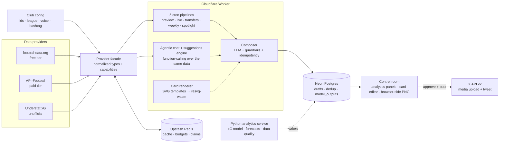

# fieldtilt — football intelligence, published

A club-agnostic football data & publishing platform, run for one club at a
time and switchable with a single environment variable. It turns live
football data into stat-led posts: five cron pipelines, two interchangeable
data providers, an xG analytics layer, an LLM agent that is structurally
prevented from inventing numbers, poster-grade infographics (full-bleed
photos under cinematic scrims, stats as the focal point), and a human
approval queue — one Cloudflare Worker at the edge, **$0/month** on free
tiers.

```
CLUB=chelsea      # default preset
CLUB=strasbourg   # different club, different league — same platform
CLUB='{"name":"Arsenal", ...}'   # any club via JSON config
```

Real production numbers: 1.85 MB gzip upload, 27 ms worker startup, ~half a
US cent of LLM spend per post, $0/month infrastructure. The full engineering
write-up, runbooks, and design docs are maintained privately.

## Architecture



Solid lines are live today; the dotted Python path is the current build
(models in Python, delivery in TypeScript — see
[analytics/](analytics/README.md)).

## Engineering highlights

- **Club as configuration:** every club fact (three provider id spaces,
  league mappings, hashtag, voice hooks) lives in one validated config
  module; prompts, crons, cards, agent, dashboard and cache keys all derive
  from it. Multi-club is an env var, not a fork.
- **Cost tiers as configuration:** two football-data providers behind one
  normalized interface with declared capabilities; every pipeline degrades
  explicitly when a capability is missing. $0 → full-stats is one API key.
- **Images under a 10 ms CPU cap:** the approval flow rasterizes SVG→PNG in
  the reviewing browser (fonts inlined as base64 `@font-face`), so the free
  plan ships real infographics; server-side wasm rendering serves the paid
  auto-post path behind the same interface.
- **Grounded LLM output:** composers only see fetched numbers, emit a SKIP
  sentinel on thin data, and the agent's `create_draft` tool rejects
  ungrounded requests with corrective errors. No invented statistics, by
  construction.
- **A suggestions engine as editorial radar:** post angles computed from
  live data — xG over/under-performers, hidden xGChain engines, defensive
  xGA claims, matchday hooks — each a one-click, re-grounded agent prompt.
- **Quota engineering:** header-driven rate limiting (the provider's own
  counters, shared across isolates), daily budget stops, and a match-window
  gate that keeps a 5-minute poller at zero API calls on non-match days.
- **Idempotency at three layers:** Redis claims before LLM spend, durable
  Postgres claims for never-repeat content, done-markers to stop tail
  polling.
- **CI that gates what people skip:** typecheck, 89 test assertions, worker
  build, bundle size, cold start, token budget, DB query count.

## The control room

Analytics panels in the house design system (hand-rolled SVG, zero chart
libraries): league xG-for/against scatter with the tracked club highlighted,
squad goals-vs-xG parity scatter, last-10 form strip. Plus the approval
queue (edit copy, edit card JSON live, add a full-bleed photo, download the
PNG, post), an agentic compose chat grounded in live data, and one-time
magic-link auth.

## Constraints this was built under

Free-tier everything (Workers 10 ms CPU, 100-req/day and 10-req/min API
quotas), no servers, one engineer, and a hard product rule that a factual
error posted publicly is worse than no post — which is why the default mode
is a human approval queue, and why every automated claim traces to a fetched
number.

## Quickstart

- Install: `pnpm install`
- Local env: copy `.env.example` → `.env` (pick a `CLUB`, add keys)
- Apply DB schema: `pnpm db:push`
- Run locally: `pnpm dev` → `http://localhost:3000`
- Tests / types: `pnpm test` · `pnpm typecheck`
- Card preview: `/api/render?kind=player_stat&format=svg` · Health: `/api/health`
- Deploy: `pnpm run deploy`

## What posts, when

Every pipeline composes: live data → grounded LLM copy → infographic card →
approval queue (or auto-post when enabled).

| Schedule (UTC) | Post |
| --- | --- |
| Daily 07:00 | Match preview + card (fixture ≤48h away, with head-to-head) |
| Every 5 min | Live score + full-time recap (match window only) |
| Daily 08:00 | Confirmed transfers (provider-dependent) |
| Mon 09:00 | Weekly form + league standing card |
| Wed 12:00 | Player spotlight with xG layer |

## Docs

[analytics/README.md](analytics/README.md) covers the Python model service
contract. Engineering notes, the design system, cost analysis, and the
deploy runbook are maintained in a private docs folder.
